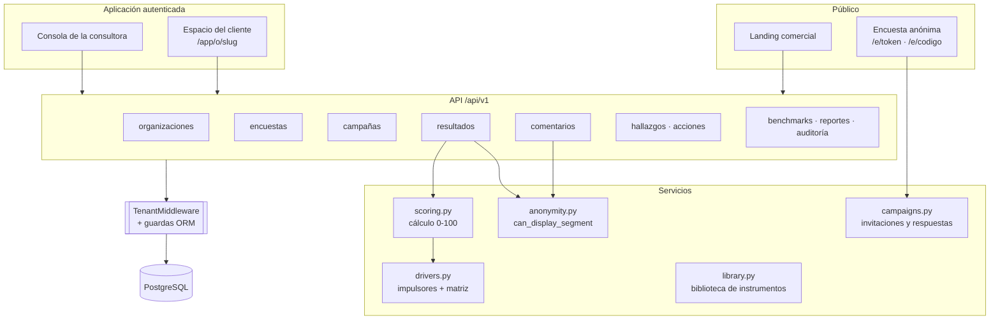

# Arquitectura

Hub de la documentación. Cada flujo punta a punta tiene su documento en
[`flujos/`](flujos/); las interfaces externas, en [`contratos/`](contratos/).

---

## 1. Diagnóstico del repositorio existente

| Elemento | Estado encontrado |
|---|---|
| `ist_webpage/` (este repo) | Sitio **Quarto estático**: `index.qmd` + `styles.css`, publicado a GitHub Pages por `.github/workflows/publish.yml`. Sin backend, sin base de datos, sin autenticación. |
| Marca | Paleta definida en `styles.css`: rojo `#eb0d1f`, rosado `#e96fd2`. |
| `../reportes-web/` (proyecto hermano) | FastAPI + Jinja2 + ECharts, cookie firmada HMAC, PBKDF2-SHA256 600k, usuarios en JSON, Docker Compose en pop-two tras Caddy + Cloudflare Tunnel. |

**Qué se reutilizó**

* Esquema de contraseñas y de sesión de `reportes-web` (idéntico), para que las
  credenciales de la consultora sean migrables entre ambos servicios.
* Patrón de despliegue: contenedor sin root (uid 10001), puerto sólo en `127.0.0.1`,
  `mem_limit`, health check, red externa y proxy delante.
* ECharts ya vendorizado (sin CDN) y el logotipo.
* Principio de `reportes-web` que se mantiene como invariante: **el cálculo corre en el
  servidor y nunca viaja al navegador**.

**Qué NO se reemplazó, y por qué**

El sitio Quarto sigue siendo la web corporativa de istendencia y se publica igual. La
plataforma es una aplicación nueva bajo `plataforma/`, con su propia página comercial de
producto. Cambiar `index.qmd` habría roto el sitio institucional para agregar contenido de
otro producto.

**Brechas cubiertas por este desarrollo**: multitenancy, autenticación con roles,
modelo de datos, motor de cálculo, confidencialidad, API, dashboards, planes de acción,
benchmarks, auditoría, tests y despliegue reproducible.

---

## 2. Stack

| Capa | Elección | Motivo |
|---|---|---|
| Lenguaje | Python 3.12 | Continuidad con `reportes-web` y con el pipeline de análisis en Python/R. |
| Web | FastAPI + Jinja2 | Ya en uso; API con OpenAPI automático y HTML server-rendered en el mismo proceso. |
| ORM | SQLAlchemy 2.0 | Permite el filtrado multitenant **centralizado** (`with_loader_criteria`). |
| Base de datos | PostgreSQL 17 (SQLite en desarrollo y tests) | Igual que el resto de la infraestructura. |
| Estadística | NumPy | Regresión y VIF sin arrastrar SciPy/pandas al contenedor. |
| Gráficos | ECharts vendorizado | Sin CDN: la aplicación funciona en redes corporativas cerradas. |
| Tests | pytest + httpx | — |

---

## 3. Diagrama

---

## 4. Invariantes globales

Reglas que valen en toda la aplicación. Romper una de estas es un incidente, no un bug.

1. **Ninguna consulta cruza organizaciones.** El filtro es central
   (`app/db.py::install_guards`), no responsabilidad de cada endpoint. Saltárselo exige
   escribir `execution_options(include_all=True)`, que es visible en revisión de código y
   está permitido sólo en servicios de plataforma (consola, benchmarks, auditoría).
2. **Escribir una fila de otro tenant lanza `TenantIsolationError`** (`before_flush`).
3. **No existe vínculo persistido entre una persona y su respuesta.** Ni FK, ni columna,
   ni índice. Ver [flujos/03](flujos/03-aplicacion-anonima.md).
4. **Todo agregado pasa por `can_display_segment()`.** Si la decisión es negativa, la API
   no devuelve el dato: no hay un payload "completo" que el frontend deba ocultar.
5. **El cálculo vive en el servidor.** El navegador dibuja lo que recibe.
6. **Una versión publicada del instrumento es inmutable.** Editarla devuelve 409.
7. **No se muestran resultados mientras la campaña está abierta** (la participación sí).
8. **Los identificadores públicos son UUID**, nunca secuenciales.
9. **Los tokens de invitación se guardan sólo como SHA-256.**
10. **El lenguaje de los impulsores es de asociación, no de causalidad.** «Factor
    asociado», «posible palanca», «prioridad sugerida».
11. **Los índices agregados salen marcados como hipótesis** pendientes de validación
    psicométrica.
12. **Los hallazgos generados por el sistema nacen como `sugerido_por_sistema`** y no
    entran a ningún reporte hasta que una persona los valida.
13. **Los comentarios sensibles se marcan para revisión humana**, nunca se concluye ni se
    acusa; su acceso se audita uno a uno y su texto jamás entra a la bitácora ni a un correo.
14. **Los datos de demostración llevan `is_demo=True`** y se muestran siempre identificados.
15. **La plataforma no sustituye instrumentos regulatorios** ni emite diagnósticos clínicos
    individuales; el texto está en la página pública, en los reportes y en el pie de la app.

---

## 5. Decisiones y sus renuncias

**Una tabla `OrgUnit` en vez de cuatro (BusinessUnit / Workplace / Department / Team).**
Los cuatro niveles comparten comportamiento (filtros, agregación, umbral, permisos) y la
profundidad real varía por cliente. Cuatro tablas obligarían a cuadruplicar cada consulta
de agregación. Los cuatro nombres se conservan como `kind` y se exponen así en API e
interfaz. *Renuncia*: no hay validación en el esquema de qué tipo puede colgar de cuál; se
valida en la capa de servicio.

**Filtrado por `do_orm_execute` en vez de `WHERE` explícito.** El aislamiento deja de
depender de la disciplina de cada desarrollador. *Renuncia*: hay que conocer el mecanismo
para depurar por qué una consulta "no ve" una fila; por eso el escape es explícito.

**Middleware ASGI puro para el contexto de tenant.** Corre en la misma tarea que el
endpoint, así el `ContextVar` es visible tanto en endpoints `async` como en los `def` que
Starlette despacha al threadpool. Con `BaseHTTPMiddleware` sería más frágil.

**SQLAlchemy síncrono.** La carga es de decenas de usuarios concurrentes, no de miles; el
código queda más simple y el cálculo es CPU-bound. *Renuncia*: si crece la concurrencia,
habrá que mover el cálculo a una cola.

**Rate limiting en memoria.** Suficiente para un proceso. *Renuncia*: con varios workers
hay que moverlo a Redis (anotado en el roadmap).

**`create_all` en vez de Alembic.** Acelera el MVP. *Renuncia*: no hay migraciones
versionadas; el primer cambio destructivo del esquema exige incorporar Alembic — está
como primera tarea de la etapa 7.

---

## 6. Índice de flujos

| Flujo | Documento |
|---|---|
| 01 · Alta de cliente y estructura | [flujos/01-alta-de-cliente.md](flujos/01-alta-de-cliente.md) |
| 02 · Diseño y versionado del instrumento | [flujos/02-instrumento.md](flujos/02-instrumento.md) |
| 03 · Aplicación anónima | [flujos/03-aplicacion-anonima.md](flujos/03-aplicacion-anonima.md) |
| 04 · Cálculo y resultados | [flujos/04-calculo-y-resultados.md](flujos/04-calculo-y-resultados.md) |
| 05 · Hallazgos, planes y pulsos | [flujos/05-hallazgos-y-acciones.md](flujos/05-hallazgos-y-acciones.md) |
| 06 · Benchmarks y reportes | [flujos/06-benchmarks-y-reportes.md](flujos/06-benchmarks-y-reportes.md) |

**Regla de mantención**: tocar un flujo ⇒ actualizar su documento en el mismo commit; leer
el documento antes de cambiar el flujo.
