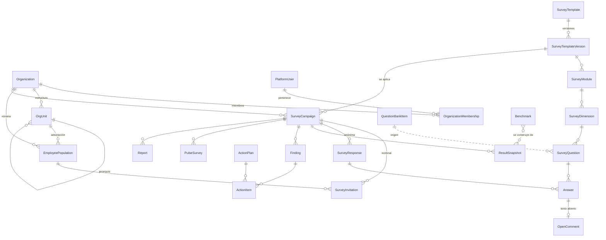

# Modelo de datos

Todas las claves primarias son UUID en texto (`String(32)`). Toda entidad de negocio
lleva `organization_id`; las entidades de catálogo compartido lo llevan **nullable**
(`NULL` = de plataforma).

⚠️ **En el diagrama no hay ninguna línea entre `SurveyInvitation` y `SurveyResponse`.**
Esa ausencia es el corazón del modelo de confidencialidad, no un olvido.

---

## Entidades

### Identidad y organización

| Entidad | Tabla | Notas |
|---|---|---|
| `PlatformUser` | `platform_users` | Correo único, PBKDF2-SHA256 600k, `is_superadmin`. |
| `Organization` | `organizations` | Tenant. `anonymity_threshold`, `min_item_completion`, `benchmark_consent`. |
| `OrganizationMembership` | `organization_memberships` | Usuario ↔ organización con rol y `scope_unit_ids` (alcance de una jefatura). |
| `OrgUnit` | `org_units` | Jerarquía con `kind`: `business_unit`, `workplace`, `department`, `team`. |
| `EmployeePopulation` | `employee_population` | Nómina: universo invitable. `attributes` guarda las variables de segmentación. |

### Instrumento

| Entidad | Tabla | Notas |
|---|---|---|
| `SurveyTemplate` | `survey_templates` | Maestra (`organization_id NULL`) o adaptada; `derived_from_id` da trazabilidad. |
| `SurveyTemplateVersion` | `survey_template_versions` | `borrador` → `publicada` (inmutable) → `retirada`. |
| `SurveyModule` | `survey_modules` | Activable/desactivable. |
| `SurveyDimension` | `survey_dimensions` | `is_outcome` separa variables de resultado; `index_key` agrupa en índices. |
| `SurveyQuestion` | `survey_questions` | Tipo, escala, `is_reverse`, `allow_na`, `display_logic`. |
| `QuestionBankItem` | `question_bank_items` | Banco reutilizable. |

### Aplicación

| Entidad | Tabla | Notas |
|---|---|---|
| `SurveyCampaign` | `survey_campaigns` | Estados §9, método de acceso, `segmentation_keys`, umbral propio, consentimiento versionado. |
| `SurveyInvitation` | `survey_invitations` | **Nominal**. Sólo `token_hash` (SHA-256). Sin FK a la respuesta. |
| `SurveyResponse` | `survey_responses` | **Anónima**. `segment` es una fotografía sin identidad; `ticket_hash` permite retomar. |
| `Answer` | `answers` | `value_num` / `value_text` / `value_json`, `is_na`. |
| `OpenComment` | `open_comments` | Texto original + `redacted_text`, `themes`, `is_sensitive`, trazas de revisión. |
| `PulseSurvey` | `pulse_surveys` | Enlaza un pulso con dimensión, hallazgo, plan, unidad y línea base. |

### Análisis y gestión

| Entidad | Tabla | Notas |
|---|---|---|
| `ResultSnapshot` | `result_snapshots` | Cálculo congelado (global o por segmento). Insumo de los benchmarks. |
| `Finding` | `findings` | Tipo, evidencia cuantitativa y cualitativa, interpretación, limitaciones, estado. |
| `ActionPlan` / `ActionItem` | `action_plans` / `action_items` | Compromisos con responsable, indicador, meta, evidencia y avance. |
| `Benchmark` | `benchmarks` | Agregado por sector/tamaño/región, con criterios y limitaciones declarados. |
| `Report` | `reports` | Reporte generado y su payload. |
| `ConsultingService` / `ConsultingEngagement` | — | Catálogo administrable y contrataciones. |
| `Lead` | `leads` | Solicitudes del formulario público (no pertenece a ningún tenant). |
| `AuditLog` | `audit_logs` | Accesos, exportaciones y denegaciones. No es `TenantScoped` porque registra también eventos de plataforma y accesos cruzados denegados. |

---

## Índices relevantes

* `organization_id` indexado en toda entidad de tenant (todas las consultas lo filtran).
* `survey_invitations.token_hash` único.
* `survey_responses.campaign_id`, `answers.response_id`, `answers.question_id`.
* `open_comments.is_sensitive` (la bandeja de revisión filtra por ahí).
* `action_items.due_on` (tablero de atrasos).

## Retención

Las respuestas se conservan mientras dure la relación con el cliente y se anonimizan o
eliminan a solicitud. Las invitaciones guardan sólo hashes. Los comentarios guardan una
versión con datos personales ocultos, que es la única que se expone.
