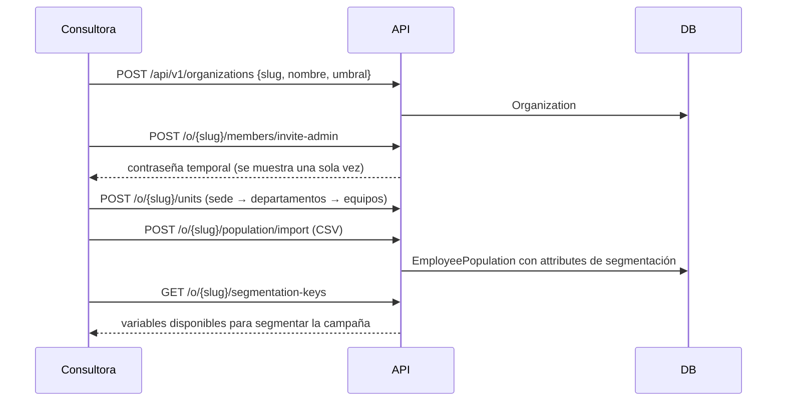

# Flujo 01 · Alta de un cliente, estructura y nómina

## Propósito

Dar de alta una organización como tenant, con sus usuarios, su estructura y su universo
invitable.

## Disparador

La consultora crea la organización desde la consola (o por API).

## Secuencia

## Modelos que toca

`Organization`, `PlatformUser`, `OrganizationMembership`, `OrgUnit`, `EmployeePopulation`.

## Código

* `app/api/organizations.py::create_organization` · `::create_unit` · `::import_population` ·
  `::segmentation_keys` · `::invite_admin`
* `app/api/users.py::add_member` · `::update_member`
* `app/security/deps.py::TenantMiddleware` · `::org_viewer` · `::build_viewer`

## Formato del CSV de nómina

Cabecera obligatoria. Columnas reconocidas: `external_id` (o `id_externo`), `email` (o
`correo`), `full_name` (o `nombre`), `unidad` (código de `OrgUnit`). **Cualquier otra
columna se guarda como variable de segmentación** y queda disponible para las campañas.

## Invariantes y trampas ⚠️

1. **El `slug` va en la URL de la organización** (`/app/o/{slug}`) y lo usa el middleware
   para activar el aislamiento. Cambiarlo invalida enlaces guardados; no hay renombrado.
2. **Una jefatura sin `scope_unit_ids` es un error de configuración** y la API lo rechaza
   (422): sin alcance no podría ver nada, y peor, sería fácil creer que ve el total.
3. **El umbral de anonimato no puede bajar de 3** ni siquiera por API.
4. **La contraseña temporal se muestra una sola vez.** No hay envío de correo configurado:
   se entrega por un canal seguro y el usuario la cambia.
5. **Las variables de segmentación viven en `attributes`**, no en columnas: cada cliente
   tiene las suyas (estamento, faena, turno, convenio). La campaña declara cuáles se
   autorizan; el resto no viaja junto a las respuestas.
6. **Cargar de nuevo el CSV actualiza por `external_id`**, no duplica. Quien desaparece del
   archivo no se borra: se desactiva manualmente (evita perder historia por un archivo mal
   exportado).
