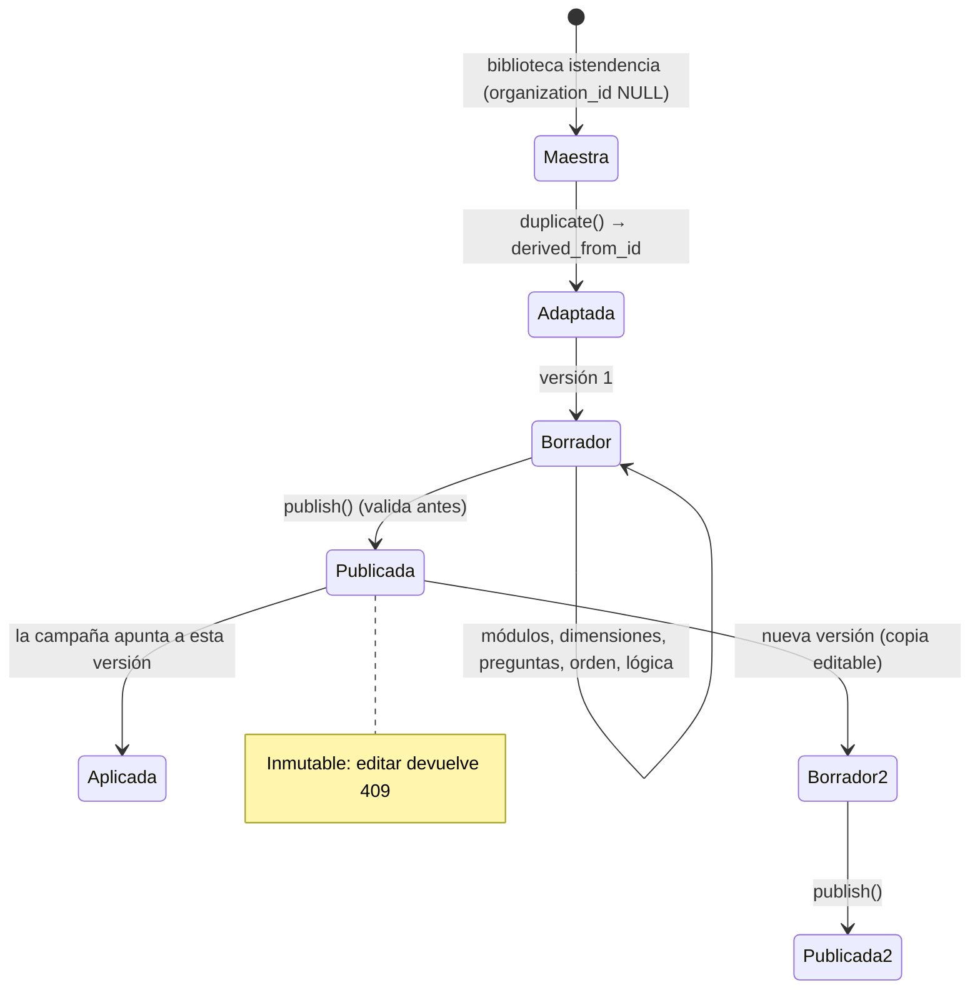

# Flujo 02 · Diseño, adaptación y versionado del instrumento

## Propósito

Que cada cliente pueda tener un instrumento adaptado a su lenguaje sin perder
comparabilidad ni trazabilidad al instrumento original.

## Disparador

La consultora duplica una plantilla maestra o crea una desde cero.

## Secuencia

## Biblioteca inicial

`app/services/library.py` materializa diez instrumentos maestros: clima integral (12
dimensiones + 5 variables de resultado + comentarios), pulso de seguimiento, evaluación de
liderazgo, seguridad psicológica, trabajo remoto o híbrido, gestión del cambio,
onboarding, salida, convivencia/respeto/inclusión y experiencia del trabajador. Todos sus
ítems alimentan además el banco de preguntas.

## Código

* `app/services/library.py::build_library` · `::clone_template` · `::_materialize`
* `app/api/surveys.py::create_template` · `::duplicate_template` · `::create_version` ·
  `::publish_version` · `::validate_version` · `::preview_version` · `::create_question`
* `app/services/scales.py` (catálogo de escalas y cortes de favorabilidad)

## Validaciones al publicar

`validate_version` bloquea la publicación si: no hay preguntas en módulos activos, hay
códigos de pregunta repetidos, una dimensión no tiene ítems puntuables, o una pregunta de
selección no tiene opciones.

## Invariantes y trampas ⚠️

1. **Una versión publicada es inmutable.** Toda edición devuelve 409 con la indicación de
   crear una versión nueva. Sin esto, cambiar una pregunta a mitad de levantamiento
   arruinaría silenciosamente la comparación.
2. **Las plantillas maestras no se editan desde una organización** (403): se duplican. Así
   la biblioteca se mantiene estable para todos los clientes.
3. **`derived_from_id` no se limpia nunca.** Es lo que permite decir «esto viene del clima
   integral v1» al construir un benchmark.
4. **Una campaña apunta a una versión, nunca a la plantilla.**
5. **`is_outcome` decide si una dimensión entra al puntaje de clima o al análisis de
   impulsores.** Marcar «compromiso» como dimensión de clima inflaría el resultado general
   con la variable que se quiere explicar.
6. **`is_reverse` se aplica en el cálculo, no en la interfaz.** El ítem se muestra tal cual
   se redactó; la recodificación ocurre en `scoring.py`.
7. **`allow_na` cambia el denominador.** Usarlo en ítems que casi todos responderán
   produce dimensiones con n muy distinto entre sí.
8. **La escala determina el corte de favorabilidad**, no una constante global: 0-10 de
   recomendación no se corta como una Likert de 5 puntos.
