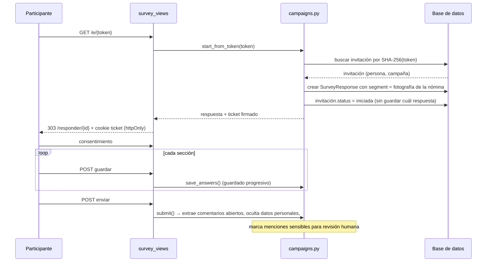

# Flujo 03 · Aplicación anónima de la encuesta

## Propósito

Levantar respuestas de forma que la organización pueda saber **cuánta gente respondió**,
pero nunca **quién respondió qué**.

## Disparador

Una persona abre su enlace personal (`/e/{token}`), escanea un QR o entra con un código
(`/e/codigo/{code}`).

## Secuencia

## Modelos que toca

`SurveyInvitation`, `SurveyResponse`, `Answer`, `OpenComment`, `EmployeePopulation`
(sólo lectura, al tomar la fotografía de segmentación).

## Código

* `app/web/survey_views.py::open_with_token` · `::open_with_code` · `::survey_page` ·
  `::save_page` · `::resume_survey`
* `app/services/campaigns.py::start_from_token` · `::start_anonymous` · `::save_answers` ·
  `::submit` · `::_segment_snapshot` · `::_extract_comments` · `::close_and_mark`
* `app/security/tokens.py::new_invitation_token` · `::token_hash` · `::make_response_ticket`

## Invariantes y trampas ⚠️

1. **No hay FK entre invitación y respuesta, en ninguna dirección.** Agregar una columna
   `response_id` a `SurveyInvitation` —aunque sea "sólo para depurar"— destruye la
   promesa central del producto. El test
   `test_flow.py::test_flujo_completo` verifica que la respuesta sólo lleva la
   segmentación.
2. **El token en claro existe únicamente en memoria**, el tiempo de construir el enlace.
   En la base queda su SHA-256. Por eso `POST /campaigns/{id}/invitations` devuelve los
   enlaces **una sola vez** y lo advierte en la respuesta.
3. **Sólo viajan a `segment` las claves declaradas en `campaign.segmentation_keys`.** Una
   variable no autorizada no queda junto a las respuestas y por lo tanto no se puede
   cruzar después. Ampliar la lista con la campaña ya activa no reescribe el pasado: las
   respuestas anteriores no tienen esa clave.
4. **El ticket identifica una respuesta, jamás a una persona.** Va firmado con HMAC en
   cookie `httpOnly`; en la base sólo queda su hash. Sin el ticket correcto,
   `/responder/{id}` responde 403 — así un enlace reenviado no expone lo ya respondido.
5. **Retomar funciona sólo en el mismo navegador.** Es una consecuencia deliberada del
   punto anterior: pedir un dato para recuperar la sesión reintroduciría la identidad.
6. **Al cerrar la campaña**, `close_and_mark` marca como `respondida` una cantidad de
   invitaciones equivalente a las respuestas recibidas, **sin decir cuáles**. El conteo es
   correcto; el emparejamiento no existe.
7. **`is_na` no es un valor.** Un «No aplica» no entra al numerador ni al denominador de
   ningún promedio.
8. **La detección de menciones sensibles marca, no concluye.** Enciende el protocolo de
   revisión humana; nunca acusa ni notifica el texto por correo.
9. **La encuesta no muestra resultados** ni mientras se responde ni al terminar.

## Dependencias externas

Ninguna. El envío de correos no está implementado: la API entrega los enlaces para que se
distribuyan por el canal que el cliente ya usa. Cuando se agregue un proveedor, el envío
debe leer el token del retorno de `generate_invitations` — nunca de la base, porque ahí no
está.
