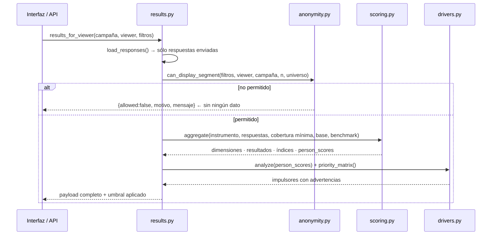

# Flujo 04 · Cálculo y entrega de resultados

## Propósito

Convertir respuestas crudas en agregados interpretables, aplicando la regla de
confidencialidad **antes** de entregar cualquier número.

## Disparador

Una consulta a `/api/v1/o/{slug}/results/{campaign_id}` (con o sin filtros) o la carga de
`/app/o/{slug}/resultados`.

## Secuencia

## Reglas de cálculo

| Regla | Implementación |
|---|---|
| Normalización 0-100 | `Scale.to_100`: `(v − min) / (max − min) × 100`. Likert 1-5 → `((v−1)/4)×100`. |
| Ítems invertidos | `Scale.reverse` **antes** de cualquier promedio. |
| Favorable / neutral / desfavorable | Definido por escala (5 puntos: 4-5 / 3 / 1-2; recomendación 0-10: 9-10 / 7-8 / 0-6). |
| Cobertura mínima | `person_dimension_map`: si respondió menos del `min_item_completion` de los ítems de la dimensión, esa dimensión no se calcula **para esa persona**. Por defecto 0,6; parametrizable por organización y por campaña. |
| «No aplica» | Se excluye del numerador y del denominador. |
| Orden de promediado | Primero dentro de la persona, después entre personas: quien responde más ítems no pesa más. |
| Variables de resultado | `is_outcome=True`: se calculan aparte y **no** entran al puntaje general de clima. |
| Intervalo de confianza | Normal al 95 %; con n < 5 no se reporta. |
| Polarización | `4·p_fav·p_desf` (0 = consenso, 1 = opiniones opuestas). Se reporta junto al promedio porque un promedio 50 puede ser consenso tibio o dos bandos. |
| Índices agregados | Promedio de dimensiones agrupadas, marcado `is_hypothesis: true`. |

## Código

* `app/services/scoring.py::aggregate` · `::person_dimension_map` · `::item_bands` ·
  `::confidence_interval` · `::polarization` · `::_indices`
* `app/services/results.py::results_for_viewer` · `::compute_payload` · `::unit_heatmap` ·
  `::baseline_scores` · `::benchmark_scores` · `::save_snapshot` · `::suggest_findings`
* `app/services/drivers.py::analyze_outcome` · `::variance_inflation` · `::priority_matrix`
* `app/api/results.py` (todos los endpoints)

## Invariantes y trampas ⚠️

1. **No existe una ruta que devuelva agregados sin pasar por `can_display_segment()`.** Si
   se agrega un endpoint nuevo de resultados, debe usar `results_for_viewer()`.
2. **Cuando el segmento no alcanza el umbral, la respuesta es 200 con `allowed:false`** y
   el motivo. No es 403: la interfaz necesita explicar la regla, no mostrar un error.
3. **Las respuestas parciales no entran al cálculo.** Sólo `status = enviada`.
4. **La comparación con la medición anterior exige la misma `version_id`.** Comparar
   versiones distintas es comparar preguntas distintas: `baseline_scores` devuelve vacío.
5. **El benchmark se elige por código de plantilla**, prefiriendo el del mismo sector.
   Si no hay uno compatible, no se muestra comparación (no se aproxima con "el más
   parecido").
6. **`person_scores` no se persiste en el snapshot.** Es el insumo del análisis de
   impulsores y se descarta en `compute_payload` antes de guardar.
7. **Los impulsores nunca afirman causalidad.** `_strength_label` produce «factor
   asociado», «posible palanca»; el payload incluye siempre `disclaimer`.
8. **Advertencias automáticas obligatorias**: n < 30 no estima el modelo; menos de 10 casos
   por predictor advierte; VIF ≥ 5 y ≥ 10 advierten; R² < 0,2 advierte.
9. **La matriz de prioridad es una sugerencia.** Su `note` lo dice, y el consultor puede
   reordenar con `override_reason`. Una alerta de acoso o discriminación entra con
   prioridad crítica aunque su correlación con el compromiso sea baja.
10. **El mapa de calor aplica supresión primaria y complementaria.** Si al ocultar unidades
    pequeñas queda una sola visible y lo oculto suma menos que el umbral, esa también se
    oculta: se deduciría por diferencia.
11. **Cada consulta de resultados se audita** con los filtros usados y si fue suprimida.

## Dependencias externas

NumPy (regresión y VIF). Sin servicios externos.
