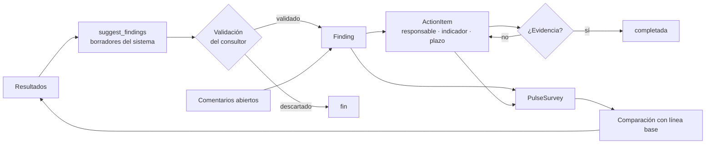

# Flujo 05 · Hallazgos, planes de acción y pulsos

## Propósito

Cerrar el ciclo: convertir resultados en interpretación validada, la interpretación en
compromisos verificables, y los compromisos en una medición de seguimiento.

## Secuencia

## Código

* `app/services/results.py::suggest_findings`
* `app/api/findings.py::suggest` · `::validate_finding` · `::update_finding`
* `app/api/actions.py::create_item` · `::update_item` · `::dashboard`
* `app/api/campaigns.py::create_pulse` · `::pulse_comparison`

## Estados

**Hallazgo**: `sugerido_por_sistema` → `en_revision` → `validado` | `descartado`.
**Acción**: `propuesta` → `aprobada` → `en_ejecucion` → `bloqueada` → `completada` |
`cancelada` | `en_evaluacion`.

## Invariantes y trampas ⚠️

1. **Un hallazgo generado por el sistema nace como sugerido** y conserva
   `is_system_generated=True` incluso después de validarse: en la interfaz se distingue de
   uno escrito por una persona.
2. **Cerrar una acción exige evidencia** (422 sin ella). Es la diferencia entre un plan que
   se cumple y uno que se declara cumplido.
3. **Una jefatura sólo puede tocar avance, estado, evidencia, riesgos, comentarios y
   próxima revisión**, y sólo de acciones dentro de su alcance. Cambiar la definición del
   compromiso requiere `action.manage`.
4. **El tablero muestra explícitamente lo incómodo**: acciones sin responsable, acciones
   completadas sin evidencia y hallazgos sin acción asociada.
5. **Un pulso no es un diagnóstico.** Compara sólo las dimensiones presentes en ambas
   mediciones y su respuesta incluye la advertencia. Con menos ítems y menor participación
   indica dirección de cambio, no nivel.
6. **La comparación de un pulso usa el snapshot de la línea base**, no un recálculo: se
   compara contra lo que efectivamente se devolvió al cliente.
7. **Los hallazgos con riesgo ético o legal no ceden ante la estadística.** El consultor
   ajusta la prioridad con `override_reason` y esa decisión queda registrada.
