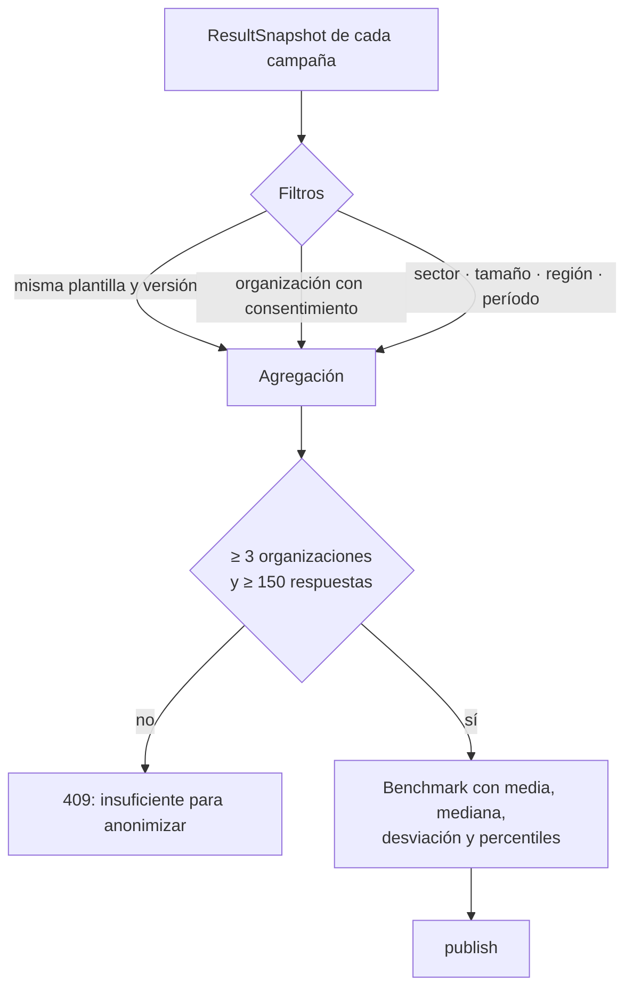

# Flujo 06 · Benchmarks y reportes

## Propósito

Comparar con referencias válidas y entregar los resultados en el formato que cada audiencia
puede usar.

## Benchmarks

### Invariantes ⚠️

1. **Consentimiento explícito**: sólo entran organizaciones con `benchmark_consent=True`.
2. **Misma plantilla y versión.** Comparar preguntas distintas produce diferencias que no
   significan nada.
3. **Mínimos de anonimización**: 3 organizaciones y 150 respuestas. Por debajo, la
   construcción devuelve 409 con el detalle de qué faltó.
4. **Cada benchmark declara** criterios de inclusión, período, cantidades y limitaciones.
   Se muestran junto a la comparación, no en una nota al pie.
5. **Se construye desde snapshots**, no desde respuestas crudas: la agregación nunca toca
   datos de nivel individual de otro tenant.
6. **Un benchmark no publicado no se usa** en ningún dashboard.

## Reportes

| Reporte | Audiencia | Contenido |
|---|---|---|
| Ejecutivo | Dirección | Participación, resultado general, tres fortalezas, tres alertas, palancas, evolución, hallazgos validados y estado del plan. |
| Organizacional | RR. HH. y consultoría | Ficha técnica, metodología, resultados por dimensión e ítem, segmentaciones, impulsores, benchmark y limitaciones. |
| Equipo | Jefatura y su equipo | Resultados permitidos, fortalezas, oportunidades, preguntas de reflexión y acciones acordadas. |

Formatos: vista web y JSON hoy; CSV para datos autorizados. PDF y presentación quedan en el
roadmap.

### Invariantes ⚠️

1. **Un reporte no puede contener un dato que la persona no vería en el dashboard**: todos
   se construyen sobre `results_for_viewer()`.
2. **Toda exportación se audita** (quién, cuándo, qué campaña, qué formato).
3. **La ficha metodológica y las limitaciones son obligatorias** en el reporte
   organizacional: incluyen que los datos son transversales y autoinformados, que no hay
   inferencia causal, que los índices son hipótesis y que el instrumento no reemplaza los
   protocolos regulatorios.
4. **El reporte de equipo no es un ranking.** No compara equipos entre sí: muestra el
   propio, sus fortalezas, sus oportunidades y preguntas para conversar.
5. **El nombre del archivo exportado se normaliza a ASCII**: las cabeceras HTTP no aceptan
   acentos y algunos clientes fallan al decodificarlas.
